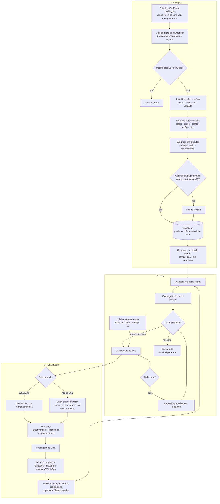

# Divulgação por kits

Como os catálogos viram kits e os kits viram posts que trazem cliente para a Lolinha.
É um documento de desenho: descreve o fluxo combinado antes da construção.

**Decisões já tomadas**

- Catálogo processado e kits ficam no **Supabase**; a Lolinha edita num **painel dentro do site**.
- O catálogo entra por um **botão de upload de vários PDFs**, com qualquer nome. O sistema identifica marca e ciclo pelo conteúdo.
- A imagem de divulgação é **montagem com fotos oficiais do catálogo**, com **layouts variados** para não cansar quem vê. Não usamos imagem gerada por IA.
- Tudo segue o *Guia de Regras e Boas Práticas da Consultoria Natura e Avon*.

## Fluxo

## 1. Catálogos

**Entrada.** No painel, o botão *Enviar catálogos* aceita vários PDFs de uma vez. Ninguém precisa saber o ciclo nem renomear arquivo. Pelo conteúdo, o sistema identifica:

- marca (Natura, Avon, Casa & Estilo);
- tipo (catálogo de ciclo, revista da consultoria, edição especial);
- ciclo e validade.

O arquivo é guardado com o nome padrão `{marca}-{ano}c{ciclo}-{tipo}.pdf`. Um arquivo repetido é reconhecido pelo hash.

**Por que o upload não passa pelo servidor do site.** Os PDFs chegam a 245 MB. Uma função da Vercel recebe no máximo 4,5 MB por requisição, e o Storage gratuito do Supabase aceita até 50 MB por arquivo. Por isso:

- o navegador envia direto para o **Vercel Blob** (upload em partes);
- a extração roda num workflow do **GitHub Actions** deste repo;
- o PDF é apagado depois de processado;
- o painel mostra o andamento: *recebido → identificado → processando → pronto / precisa revisar*.

**Extração em duas camadas.**

| Camada | O que faz | Por que assim |
|---|---|---|
| Determinística (PyMuPDF) | Código de 6 dígitos, preço `R$`, pontos `NN pts`, posição das fotos e seção. Na Natura, a seção sai do sumário; na Avon, dos títulos de seção. | Não erra código nem preço, e não tem custo |
| IA (Claude) | Agrupa os blocos de cada página em produtos (nome, linha, variantes de cor ou fragrância, refil) e marca as necessidades pela taxonomia do quiz (`lib/necessidades.ts`) | O layout muda entre páginas e revistas. A IA só pode usar códigos que a camada determinística achou |

**Fotos.** Recorte em alta resolução, remoção da borda branca, conversão para WebP e uma foto por código. A foto não muda de um ciclo para outro; o preço muda.

**Controle de qualidade.** Página em que a quantidade de códigos não bate com a de produtos vai para revisão. Gabarito: o pedido real do ciclo 13 tem os códigos `135406` e `135407` (pó compacto Avon, 7 pts cada), que precisam sair do catálogo Avon c13 com esses pontos.

**Diferença entre ciclos.** Para cada ciclo, o sistema marca o que entrou, o que saiu e o que ficou mais barato. É a mesma arbitragem de promoção que a Lolinha já faz por instinto.

## 2. Kits

**Ponto de partida.** A regra que já existe em `lib/catalog.ts` (`buildKits`: um kit por necessidade mais o Kit Completo). A IA acrescenta combinação, nome e o porquê de cada kit.

**Regras**, configuráveis em tabela e não fixas no código:

- só produtos do ciclo vigente;
- necessidades coerentes ou complementares;
- faixa de ticket;
- margem estimada pelo nível da Lolinha (hoje Bronze: 30% Natura, 30% Avon, 15% Casa & Estilo);
- pontos;
- itens em promoção;
- datas do calendário;
- variedade: não repetir kits dos últimos ciclos.

**Painel da Lolinha** (`/painel/kits`, feito para celular). Ela pode aprovar, editar (trocar ou remover item), descartar ou montar do zero buscando por nome, código ou foto. O preço padrão é o da revista do ciclo, que é o que o Guia recomenda; se ela mudar, o painel avisa.

**Estados.** *sugerido → aprovado → publicado → expirado*. Na virada do ciclo, o kit aprovado vira rascunho do ciclo seguinte, já com os preços novos e com aviso se algum item saiu do catálogo.

O `/kits` público passa a mostrar os kits aprovados. Enquanto não houver nenhum, continua como hoje.

## 3. Divulgação

**Peça.** Imagem gerada no próprio site (`next/og`) em dois formatos: 1080×1080 para post e 1080×1920 para status.

**Variação para não cansar.** Vários layouts, paletas e tipos de chamada, com rodízio que evita repetir os últimos usados. As legendas saem em tons diferentes.

**Checagem do Guia, embutida na geração.**

- "Consultora de Beleza Natura e Avon" sempre visível.
- Sem logo das marcas como identidade e sem copiar o layout dos sites delas.
- Sem pessoas geradas por IA.
- Preço da revista e validade do ciclo na peça.
- Cupom sempre com regra e validade explícitas; nunca cupom vencido.

**Destino, escolhido por kit.**

| Destino | Link | Como medimos | Observação |
|---|---|---|---|
| WhatsApp da Lolinha | `wa.me` com mensagem que cita o kit (`lib/whatsapp.ts`) | Mensagens que chegam com o código do kit | Serve para qualquer marca e para o canal tradicional |
| Minha Loja | Link visível da loja, **sem UTM e sem redirect** | Cupom exclusivo da campanha, visto em Minhas Vendas | Só para kits Natura/Avon: cupom não vale para Casa & Estilo e sai do lucro dela |

**Publicação semiautomática.** No celular, o botão *Compartilhar* abre Facebook, Instagram ou WhatsApp com a imagem e a legenda prontas. Postar sozinho pela API da Meta fica fora do escopo (exige Página e revisão do app), e o status do WhatsApp não tem API.

**Mídia paga.** Impulsionamento no Facebook, Instagram e TikTok é permitido pelo Guia. Link patrocinado de busca (Google Ads, Bing) é proibido.

## Dados (Supabase)

| Tabela | Conteúdo |
|---|---|
| `catalogos_recebidos` | hash, marca, ciclo, tipo, validade, status, contagens |
| `produtos` | código, marca, nome, linha, variante, seção, necessidades, foto |
| `ofertas` | código, ciclo, região, preço, pontos, página |
| `regras_kit` | parâmetros das regras acima |
| `kits`, `kit_itens` | estado, destino, cupom, itens |
| `pecas` | layout usado, formato, data |

## Etapas de construção

| Etapa | Entrega |
|---|---|
| C1 | Upload múltiplo, identificação automática e extração para o Supabase |
| C2 | Sugestão de kits pela IA |
| C3 | Painel com login para a Lolinha editar kits |
| C4 | Gerador de peças e botão de compartilhar |

**Custo estimado.** A extração com Claude (Batch API) sai por volta de US$ 2,40 por revista; com Natura e Avon a cada ciclo, cerca de US$ 7 por mês. Sugestão de kits e legendas custam centavos. Supabase, Vercel e GitHub Actions ficam no plano gratuito.

## Para detalhar juntos

- Quantos kits por ciclo a Lolinha quer revisar sem virar trabalho?
- Qual a faixa de ticket de um kit bom para a clientela dela?
- Casa & Estilo entra em kit? Paga 15% de margem e não aceita cupom.
- Qual o destino padrão, WhatsApp ou Minha Loja?
- Quem paga os cupons fixos da loja (`PRIMEIRAML`, `MEUNIVER`)? Perguntar no 0800 antes de desenhar campanha com eles.
- Com que frequência postar, e em quais redes ela já tem público?

## Pendências

- A revista Casa & Estilo ainda não foi enviada; ela entra pelo mesmo botão.
- Configurar na Vercel as variáveis do Supabase e do WhatsApp e ativar o Blob. No GitHub, criar os segredos da Anthropic e do Supabase.
- Evitar a pausa do Supabase gratuito por inatividade com um cron diário.
